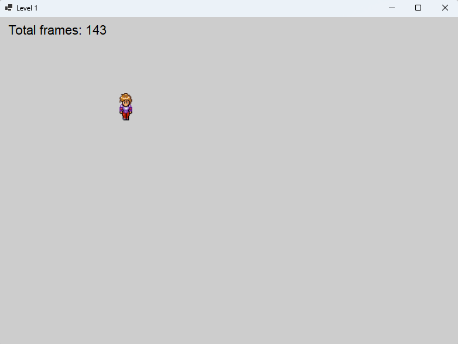

## **Tutorial: Membuat Game Sprite Animasi dengan Java**

---

### **Tujuan**
Mempelajari cara membuat game sederhana dengan animasi sprite yang berjalan menggunakan Java. Pemain dapat bergerak ke atas, bawah, kiri, dan kanan dengan animasi dari sprite sheet.



---

## **Lingkungan Pengembangan**
- **Platform**: Java 11
- **IDE**: Eclipse
- **Proyek**: Maven

---

## **Struktur Proyek**
```
src/
  main/
    java/
      id/its/pbo/
        Main.java
        GamePanel.java
        Player.java
    resources/
      rpg_sprite_walk.png
```

---

## **Langkah-Langkah**

### **1. Menambahkan File Sprite Sheet**
1. Tambahkan sprite sheet bernama `rpg_sprite_walk.png` ke folder `resources` di dalam proyek Maven.
   - Contoh struktur folder:
     ```
     src/
       main/
         resources/
           rpg_sprite_walk.png
     ```

2. File `rpg_sprite_walk.png` harus berupa sprite sheet dengan 4 baris (untuk arah) dan 8 kolom (untuk frame animasi).

**Coba Jalankan Aplikasi**
- Belum ada kode untuk dijalankan, tetapi pastikan file resource tersedia untuk langkah berikutnya.

---

### **2. Membuat Kelas GamePanel**

**Langkah:**
1. Buat file `GamePanel.java` di `src/main/java/id/its/pbo`.
2. Tambahkan kode berikut:

```java
package id.its.pbo;

import javax.swing.*;
import java.awt.*;
import java.awt.event.*;

public class GamePanel extends JPanel {

    public GamePanel() {
        setFocusable(true);
        setBackground(Color.LIGHT_GRAY);
        setLayout(null);
    }
}
```

**Coba Jalankan Aplikasi**
1. Buat **kelas Main** seperti di langkah berikut untuk menguji `GamePanel`.

---

### **3. Membuat Kelas Main**

**Langkah:**
1. Buat file `Main.java` di `src/main/java/id/its/pbo`.
2. Tambahkan kode berikut:

```java
package id.its.pbo;

import javax.swing.*;

public class Main {
    public static void main(String[] args) {
        SwingUtilities.invokeLater(() -> {
            JFrame frame = new JFrame("Sprite Animation Game");
            frame.setDefaultCloseOperation(JFrame.EXIT_ON_CLOSE);
            frame.setSize(800, 600);
            frame.setResizable(false);
            frame.add(new GamePanel());
            frame.setVisible(true);
        });
    }
}
```

**Coba Jalankan Aplikasi**
1. Jalankan `Main.java`.
2. Pastikan jendela permainan terbuka tanpa error.

---

### **4. Membuat Kelas Player**

**Langkah:**
1. Buat file `Player.java` di `src/main/java/id/its/pbo`.
2. Tambahkan kode berikut di kelas `Player`

```java
package id.its.pbo;

import java.awt.*;
import java.awt.event.KeyEvent;
import java.awt.image.BufferedImage;
import java.io.IOException;
import javax.imageio.ImageIO;

public class Player {
    private static final int SPRITE_WIDTH = 24;
    private static final int SPRITE_HEIGHT = 32;
    private static final int TOTAL_FRAMES = 8;

    private BufferedImage spriteSheet;
    private Point position;
    private int currentFrame = 0;
    private int currentRow = 0;

    public Player(String spritePath, Point startPosition) throws IOException {
        spriteSheet = ImageIO.read(getClass().getResource(spritePath));
        position = startPosition;
    }

    public void draw(Graphics g) {
        int frameX = currentFrame * SPRITE_WIDTH;
        int frameY = currentRow * SPRITE_HEIGHT;
        BufferedImage currentSprite = spriteSheet.getSubimage(frameX, frameY, SPRITE_WIDTH, SPRITE_HEIGHT);

        g.drawImage(currentSprite, position.x, position.y, SPRITE_WIDTH, SPRITE_HEIGHT, null);
    }

}
```

3. Tambahkan kode berikut di kelas `GamePanel` untuk menampilkan karakter `Player`.

```java

package id.its.pbo;

import javax.swing.*;
import java.awt.*;
import java.awt.event.*;
import java.io.IOException;

public class GamePanel extends JPanel {

    private Player player;

    public GamePanel() {
        setFocusable(true);
        setBackground(Color.LIGHT_GRAY);
        setLayout(null);

        try {
            player = new Player("/rpg_sprite_walk.png", new Point(50, 50));
        } catch (IOException e) {
            e.printStackTrace();
        }

    }

    @Override
    protected void paintComponent(Graphics g) {
        super.paintComponent(g);
        if (player != null) {
            player.draw(g);
        }
    }

}


```

**Coba Jalankan Aplikasi**
1. Jalankan `Main.java` kembali.
2. Karakter `Player` akan tampil di layar.

---

### **5. Menambahkan Fungsi Berjalan dan Berhenti pada Player**

**Langkah:**
1. Tambahkan metode `walk` untuk mekanisme berjalan, `stopWalking` untuk mekanisme berhenti jalan

```java
package id.its.pbo;

import java.awt.*;
import java.awt.event.KeyEvent;
import java.awt.image.BufferedImage;
import java.io.IOException;
import javax.imageio.ImageIO;

public class Player {

    //kode sebelumnya...

    private boolean isMoving = false;

    public void walk(int keyCode, int boundaryWidth, int boundaryHeight) {
        int speed = 10;
        isMoving = true;

        switch (keyCode) {
            case KeyEvent.VK_DOWN:
                currentRow = 0;
                if (position.y + SPRITE_HEIGHT < boundaryHeight) {
                    position.y += speed;
                }
                break;
            case KeyEvent.VK_UP:
                currentRow = 1;
                if (position.y > 0) {
                    position.y -= speed;
                }
                break;
            case KeyEvent.VK_LEFT:
                currentRow = 2;
                if (position.x > 0) {
                    position.x -= speed;
                }
                break;
            case KeyEvent.VK_RIGHT:
                currentRow = 3;
                if (position.x + SPRITE_WIDTH < boundaryWidth) {
                    position.x += speed;
                }
                break;
        }
    }

    public void stopWalking() {
        isMoving = false;
        currentFrame = 0;
    }

    public void animate() {
        if (isMoving) {
            currentFrame = (currentFrame + 1) % TOTAL_FRAMES;
        }
    }
}
```

---

### **5. Menambahkan Timer untuk Animasi**

**Langkah:**
1. Tambahkan atribut `player`, `animationTimer` di kelas `GamePanel`. Implementasi interface `ActionListener` melalui metode `actionPerformed` yang berguna untuk merefresh layar dan menganimasi dalam interval tertentu. Implementasi pula interface `KeyListener` untuk menangkap event keyboard yang berfungsi untuk menggerakkan player.

```java
package id.its.pbo;

import javax.swing.*;
import java.awt.*;
import java.awt.event.*;
import java.io.IOException;

public class GamePanel extends JPanel implements ActionListener, KeyListener {
    private final int ANIMATION_INTERVAL = 100;
    private Timer animationTimer;
    private Player player;

    public GamePanel() {
        setFocusable(true);
        setBackground(Color.LIGHT_GRAY);
        setLayout(null);

        try {
            player = new Player("/rpg_sprite_walk.png", new Point(50, 50));
        } catch (IOException e) {
            e.printStackTrace();
        }

        animationTimer = new Timer(ANIMATION_INTERVAL, this);
        animationTimer.start();

        addKeyListener(this);
    }

    @Override
    protected void paintComponent(Graphics g) {
        super.paintComponent(g);
        if (player != null) {
            player.draw(g);
        }
    }

    @Override
    public void actionPerformed(ActionEvent e) {
        if (player != null) {
            player.animate();
        }
        repaint();
    }

    @Override
    public void keyPressed(KeyEvent e) {
        if (player != null) {
            player.walk(e.getKeyCode(), getWidth(), getHeight());
        }
    }

    @Override
    public void keyReleased(KeyEvent e) {
        if (player != null) {
            player.stopWalking();
        }
    }

    @Override
    public void keyTyped(KeyEvent e) {}
}
```

---

### **Menjalankan Game**
1. Jalankan `Main.java` untuk memainkan game.
2. Tekan tombol panah dan pastikan pemain bergerak dengan animasi berjalan.